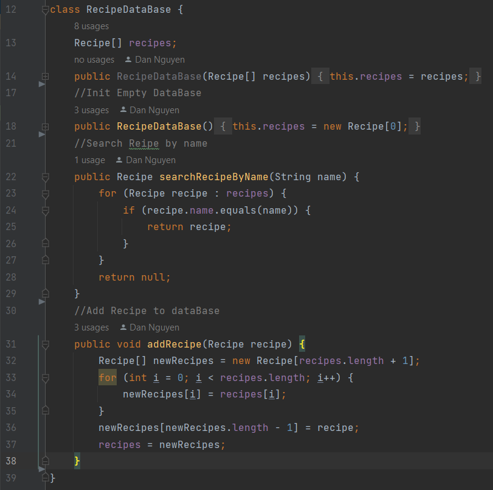
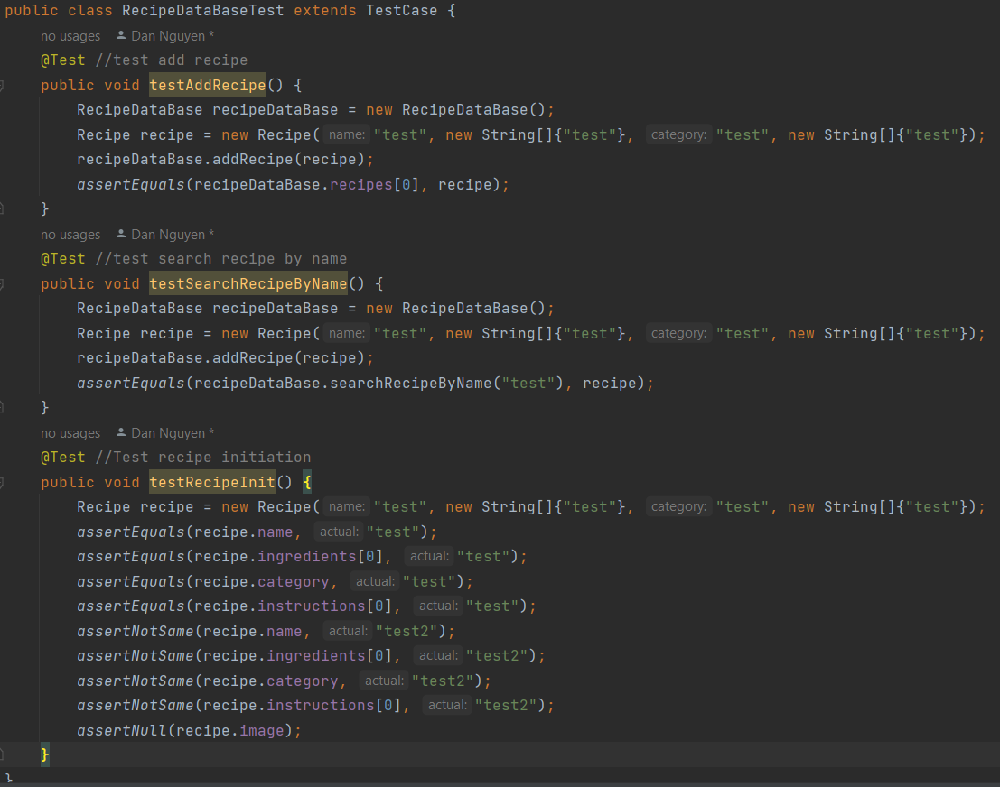

# Recipe Database and Recipe Management System

## Source code
Below is the source code written to create Recipe Database with 
add and search feature. The code is written in Java.
The code is written in Object-Oriented-Programming style. In which
the recipe database is a class and the recipe is a class.

## Testing
The code is tested using JUnit. The test cases are written to test the add and search
feature of the recipe database. Additionally, we also test the initialization of a single recipe.

